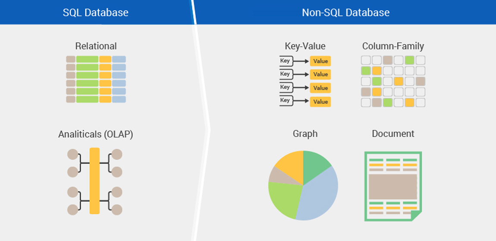

[6 Types of Data in Statistics & Research: Key in Data Science (intellspot.com)](http://www.intellspot.com/data-types/)  
  
- **Quantitative data** (how many, how much, how often, expressed as number or qualified)
	- Discrete data (integers count, whole numbers)
	- Continous data (measured scale)
- **Qualitative data** (no number, can't be measured, called categorical)
	- Nominal data (labelling variables, names of items)
	- Ordinal data (sequence that can be ordered)

[[Types]]

### Database differences

[mysql - Relationship between catalog, schema, user, and database instance - Stack Overflow](https://stackoverflow.com/questions/7942520/relationship-between-catalog-schema-user-and-database-instance)

![[DataStoreTypes.jpg]]

[Difference between Row and Column oriented Stores](https://www.geeksforgeeks.org/difference-between-row-oriented-and-column-oriented-data-stores-in-dbms/)

[Apache Spark Avro vs. Apache Parquet performance](https://stackoverflow.com/questions/53571888/spark-avro-vs-parquet-performance)

[Apache parquet format compared to others](https://stackoverflow.com/questions/36822224/what-are-the-pros-and-cons-of-parquet-format-compared-to-other-formats)

[Apache Arrow vs Apache Parquet vs ORC](http://dbmsmusings.blogspot.com/2017/10/apache-arrow-vs-parquet-and-orc-do-we.html)

[CSV vs Parquet vs Avro: Choosing the Right Tool for the Right Job | by Mikhail Levkovsky | SSENSE-TECH | Medium](https://medium.com/ssense-tech/csv-vs-parquet-vs-avro-choosing-the-right-tool-for-the-right-job-79c9f56914a8)

